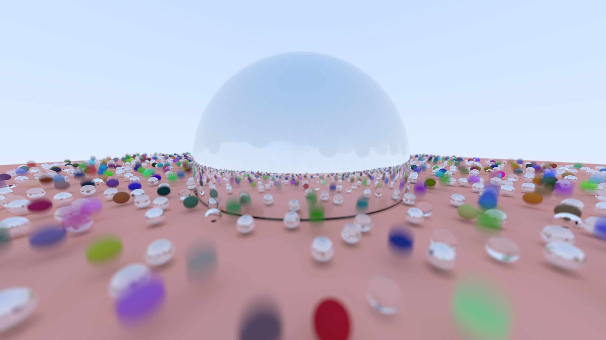

# Ray Tracing in Rust

This project is a ray tracing engine implemented in Rust. It uses a perspective camera to render 3D scenes composed of spheres with different materials. The engine supports diffuse, metal, and glass materials, and uses multi-threading to speed up the rendering process.

## Features

- Perspective camera with adjustable field of view, aspect ratio, and depth of field.
- Support for spheres as the primary drawable object.
- Materials include Lambertian (diffuse), Metal, and Dielectric (glass).
- Multi-threading support using the Rayon library for faster rendering.
- Output in PPM image format.

## Usage

To run the project, simply execute the `main` function in `src/main.rs`. This will generate a PPM image of a scene composed of a large number of randomly placed spheres with different materials.

The `main` function first checks if an image file already exists and removes it. It then sets up the world by creating a ground sphere and a number of randomly placed spheres with different materials. The camera settings are then configured, and the scene is rendered.

The rendered image is saved as `image.ppm`. The image can be viewed using any image viewer that supports the PPM format. The code currently uses the ImageGlass viewer, but this can be replaced with any preferred image viewing program.

## Code Structure

The code is organized into several modules:

- `drawable`: Contains the `Sphere` struct and the `Traceable` trait which are used to represent objects that can be drawn in the 3D scene.
- `materials`: Contains the `Material` trait and the `Lambertian`, `Metal`, and `Dielectric` structs which represent different types of materials that can be applied to the drawable objects.
- `math`: Contains mathematical functions and utilities used throughout the project.
- `perspective_camera`: Contains the `Camera` struct which is used to set up the perspective from which the scene is viewed.
- `vectors`: Contains the `Vec3`, `Point3`, `Ray`, and `Color` structs which are used to represent 3D vectors, points in 3D space, rays of light, and colors respectively.

## Dependencies

This project uses the following dependencies:

- `rand`: Used to generate random numbers for various purposes such as positioning the spheres and determining their materials.
- `rayon`: Used to parallelize the rendering process for performance improvement.

## Performance

The project is optimized for performance. The `Cargo.toml` file specifies several settings for the release profile that help improve the speed of the ray tracing engine:

- `codegen-units` is set to 1, which can lead to better optimizations by the compiler.
- `lto` is set to "fat", which enables Link Time Optimization, further improving performance.
- `opt-level` is set to 3, which tells the compiler to focus on optimizing the code for speed.
- `panic` is set to 'abort', which can result in smaller binary size and faster code, but panics will cause the program to abort rather than unwind.

Please note that these settings may make the compilation process slower and use more memory.